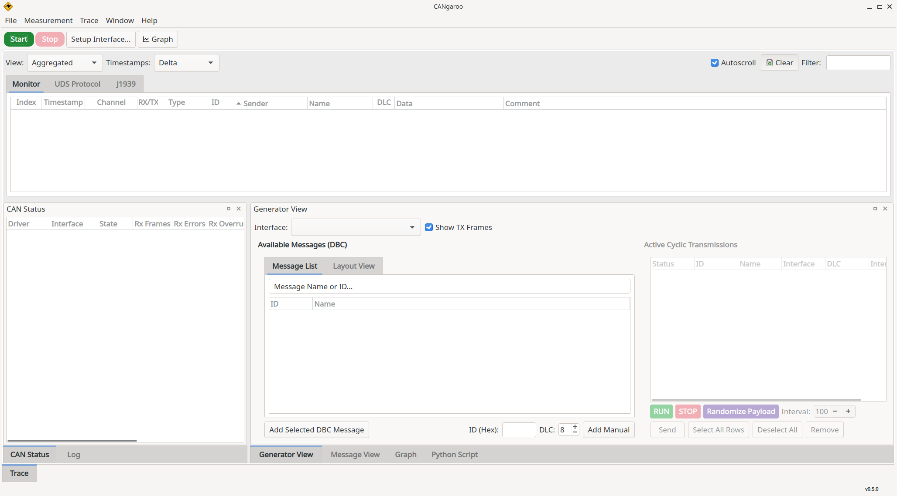

#  CANgaroo
**Open-source CAN bus analyzer for Linux 🐧 / Windows 🪟**

**🔩 Supported Interfaces & Hardware:**

| Interface | Linux | Windows | Notes |
| :--- | :---: | :---: | :--- |
| **SocketCAN** | ✅ | — | Any kernel CAN interface (`can0`, `vcan0`, …) |
| **PEAK PCAN** | ✅ | ✅ | PCAN-USB, PCAN-USB Pro, PCAN-PCIe, … via PCAN-Basic SDK |
| **Kvaser** | ✅ | ✅ | USB/CAN Leaf and other Kvaser devices via CANlib SDK |
| **Candlelight / CANable** | ✅ | ✅ | CANable (Candlelight firmware), MKS CANable, cantact, … |
| **SLCAN** | ✅ | ✅ | CANable (SLCAN firmware), Arduino CAN shields |
| **CANblaster** | ✅ | ✅ | UDP-based remote CAN via [CANblaster](https://github.com/OpenAutoDiagLabs/CANblaster) |
| **GrIP** | ✅ | ✅ | GrIP protocol |

## ⚙️ Features

*   **Real-time CAN/CAN-FD Decoding**: Support for standard and high-speed flexible data-rate frames.
*   **Wide Hardware Compatibility**: Works with **SocketCAN** (Linux), **PEAK PCAN**, **Kvaser**, **CANable**, **Candlelight**, **SLCAN**, and **CANblaster** (UDP).
*   **DBC Database Support**: Load multiple `.dbc` files to instantly decode frames into human-readable signals.
*   **Powerful Data Visualization**: Integrated Graphing tools supporting Time-series, Scatter charts, Text-based monitoring, and interactive Gauge views with zoom and live tooltips.
*   **Advanced Filtering & Logging**: Isolate critical data with live filters and export captures for offline analysis.
*   **Python Scripting**: Built-in script editor with an embedded Python interpreter (via pybind11). Send and receive CAN messages, decode signals using loaded DBC files, and automate tasks. Scripts can be started manually or automatically with the measurement.
*   **Trace Replay**: Replay captured CAN logs (Vector ASC and candump formats) with adjustable speed, per-message RX/TX direction filtering, channel mapping to live interfaces, and optional autoplay with the measurement. Supports classic CAN, CAN-FD, RTR, and error frames.
*   **Modern Workspace**: A clean, dockable userinterface optimized for multi-monitor setups.

<br><br>

## Languages
* 🇩🇪 German
* 🇺🇸 English
* 🇪🇸 Spain
* 🇨🇳 Chinese

## 🛠️ Building
### 🐧 Linux

#### Install dependencies:
| Distribution | Command |
| :--- | :--- |
| **Ubuntu / Debian** | `sudo apt install build-essential qt6-base-dev qt6-charts-dev qt6-serialport-dev qt6-tools-dev qt6-l10n-tools libqt6opengl6-dev libnl-3-dev libnl-route-3-dev python3-dev pybind11-dev pkg-config` |
| **Fedora** | `sudo dnf install gcc-c++ make qt6-qtbase-devel qt6-qtcharts-devel qt6-qtserialport-devel qt6-qttools-devel libnl3-devel python3-devel pybind11-devel pkgconfig` |
| **Arch Linux** | `sudo pacman -S base-devel qt6-base qt6-charts qt6-serialport qt6-tools libnl python pybind11 pkgconf` |

#### Build:
```bash
qmake6
make -j$(nproc)
```
The binary will be in `bin/cangaroo`.

### 🪟 Windows
* Install [Qt 6](https://www.qt.io/download-qt-installer) (Community / Open Source) with Qt Creator.
* Install [Python 3](https://www.python.org/downloads/) and [pybind11](https://github.com/pybind/pybind11) (`pip install pybind11`).
* Open `cangaroo.pro` in Qt Creator and build.

#### Optional hardware drivers

Both drivers are opt-in. Enable them by passing the corresponding `CONFIG` flag to qmake, or by adding them to the project settings in Qt Creator.

**PEAK PCAN** (`CONFIG+=peakcan`):
  1. Download [PCAN-Basic SDK](https://www.peak-system.com/fileadmin/media/files/PCAN-Basic.zip) and extract to `src/driver/PeakCanDriver/pcan-basic-api/`.
  2. Build with `qmake CONFIG+=peakcan` (or add `peakcan` to the Qt Creator qmake arguments).
  3. Place `PCANBasic.dll` (from `pcan-basic-api/Bin/x64/`) next to the built `.exe`.

**Kvaser** (`CONFIG+=kvaser`):
  1. Install the [Kvaser CANlib SDK](https://www.kvaser.com/downloads-kvaser/) (V5.51.461 or newer).
  2. Build with `qmake CONFIG+=kvaser CANLIB_DIR="C:/path/to/Kvaser/Canlib"`.
  3. Place `canlib32.dll` next to the built `.exe`.

#### Deployment
Include the required Qt6 libraries or run `windeployqt` on the `.exe`:
```
windeployqt --release cangaroo.exe
```

### ARXML to DBC Conversion
Cangaroo natively supports DBC. If you have ARXML files, you can convert them using `canconvert`:
```bash
# Install canconvert
pip install canconvert

# Convert ARXML to DBC
canconvert TCU.arxml TCU.dbc
```

## 📥 Download

Download the latest release from the [Releases](https://github.com/Schildkroet/CANgaroo).


## 📜 Credits
Written by Hubert Denkmair <hubert@denkmair.de>

Further development by:
* Ethan Zonca <e@ethanzonca.com>
* WeAct Studio
* Schildkroet (https://github.com/Schildkroet/CANgaroo)
* Wikilift (https://github.com/wikilift/CANgaroo)
* Jayachandran Dharuman (https://github.com/OpenAutoDiagLabs/cangaroo)
